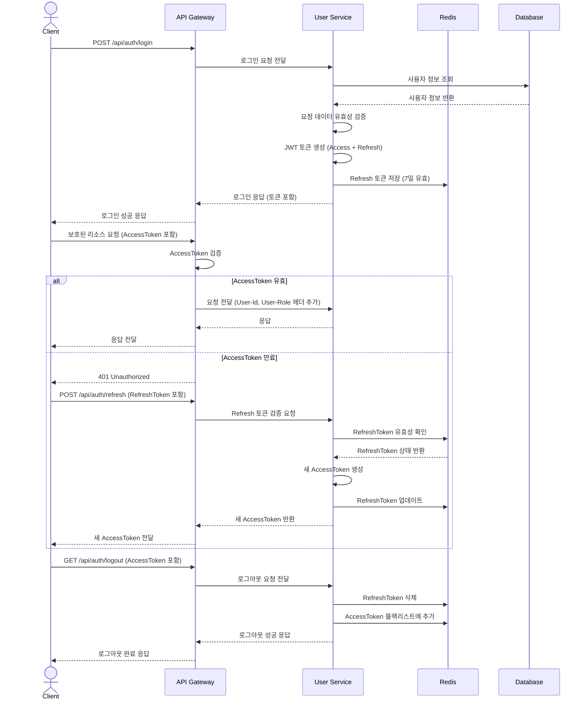
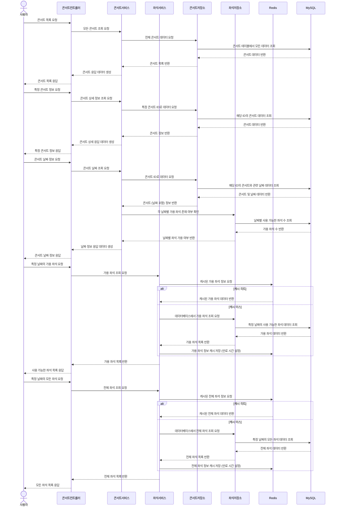
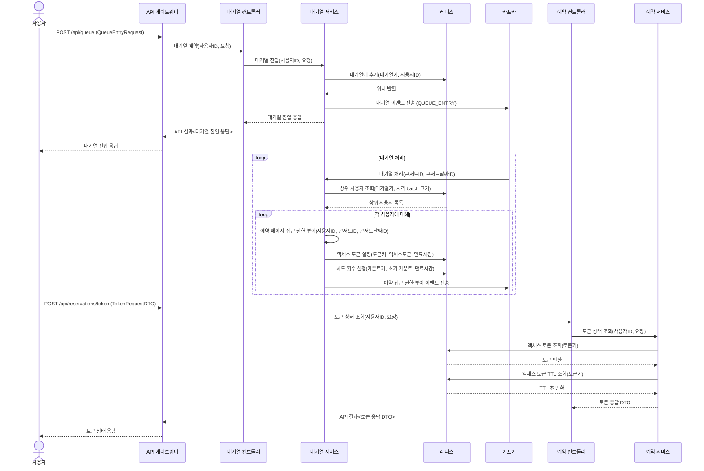
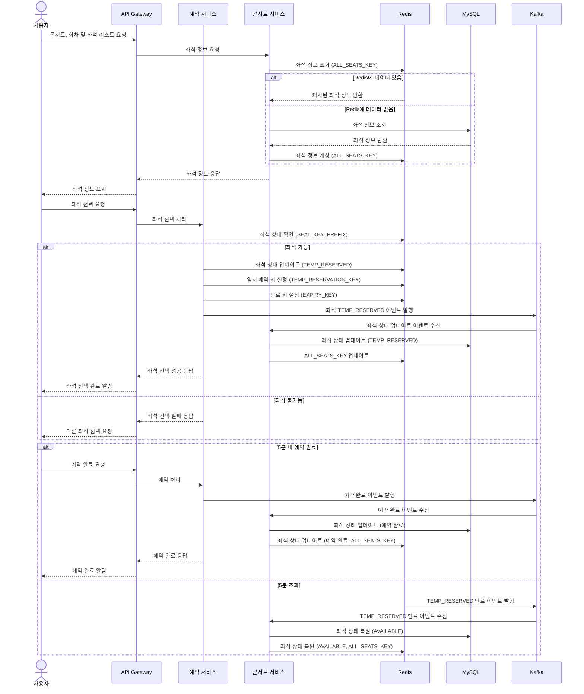
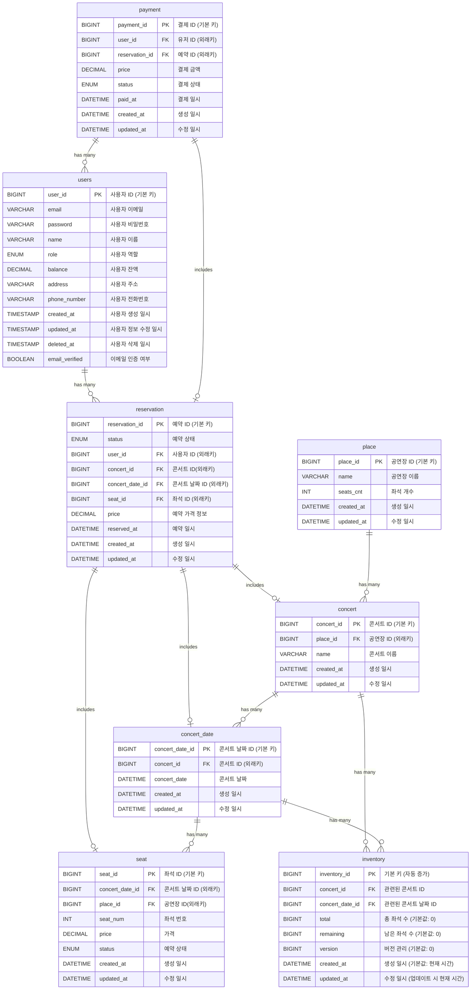

여기 문서의 목차를 마크다운 문법에 맞게 수정한 버전입니다:

# 콘서트 티켓 좌석 예매

## 목차

1. [프로젝트 Milestone](###1-프로젝트-milestone)
2. [POSTMAN API Docs](###2-postman-api-docs)
3. [시스템 아키텍처](###3-시스템-아키텍처)
4. [UML 다이어그램](###4-uml-다이어그램)
5. [대기열 설계 및 구현](##5-대기열-설계-및-구현)
6. [인사이트](###6-인사이트)
7. [기술 스택](###7-기술-스택)

---

### 1.프로젝트 Milestone

[구글닥스 문서 바로가기](https://docs.google.com/spreadsheets/d/17yUn-cEa9uq2jE7_bTpjfXoeaXIAGt_91FmHhMm2BJo/edit?gid=0#gid=0)

### 2.POSTMAN API Docs

[POSTMAN UI](https://documenter.getpostman.com/view/14042841/2sA3kSoPGR)

### 3.시스템 아키텍처

### 4.UML 다이어그램

인증&인가 프로세스

콘서트 서비스 프로세스

대기열 프로세스

예매 프로세스

### ERD 명세

데이터베이스 객체 관계 다이어그램

---

### 5.대기열 설계 및 구현

1. 유즈 케이스 설정

* 콘서트 목록 조회, 콘서트 상세 정보 조회, 콘서트 날짜 조회 API는 대기열 적용 제외
* 특정 콘서트 날짜의 좌석 조회 API에 대기열 적용
* 사용자가 콘서트 날짜를 선택하고 '좌석 선택' 버튼을 클릭할 때 대기열 진입

2. API 목록

* 대기열 진입 및 상태 조회
    * POST /api/queue
        * request: QueueEntryRequest (concertId, concertDateId)
        * response: QueueEntryResponse (userId, position, concertId, concertDateId)
        * 새로운 대기열 진입 요청 시 Redis에 사용자 추가 및 대기 순서 반환
* 대기열 상태 조회
    * GET /api/queue/status
        * request: QueueEntryRequest (concertId, concertDateId)
        * response: QueueStatusResponse (userId, concertId, concertDateId, status, position, token)
        * 현재 대기 상태, 순서, 접근 토큰(발급된 경우) 반환
* 토큰 상태 조회
    * POST /api/reservations/token
        * request: TokenRequestDTO (concertId, concertDateId)
        * response: TokenResponseDTO (userId, concertId, concertDateId, status, position, token, expiryTime)
        * 토큰의 유효성, 만료 시간, 대기 상태 정보 반환
* 클라이언트는 QueueStatusResponse의 status가 READY가 될 때까지 주기적으로 상태 조회 API를 호출
* READY 상태가 되면 좌석 조회 페이지로 이동, 이후 요청 시 헤더에 토큰 포함

3. 대기열 및 토큰 구현

* Redis를 사용하여 대기열과 토큰 관리
* 대기열: Sorted Set 사용 (key: queue:{concertId}:{concertDateId}, score: 진입 시간, member: userId)
* 토큰: String 사용 (key: token:{userId}:{concertId}:{concertDateId}, value: 생성된 토큰)
* 토큰 상태:
    * WAITING: 대기열에 있는 상태
    * READY: 접근 권한이 부여된 상태
    * NOT_IN_QUEUE: 대기열에 없는 상태
* 토큰 만료: 발급 후 일정 시간(예: 10분) 경과 시 자동 삭제

4. 대기열 처리 및 토큰 활성화 방식

* 주기적으로(예: 10초마다) 일정 수(예: 100명)의 사용자를 대기열에서 제거하고 접근 토큰 발급
* Kafka를 사용하여 대기열 처리 이벤트 발행 및 소비
* 처리 과정:
    1. Redis에서 상위 N명의 사용자 조회
    2. 각 사용자에 대해 접근 토큰 생성 및 저장
    3. 대기열에서 해당 사용자 제거
    4. Kafka를 통해 접근 권한 부여 이벤트 발송

5. 동시 접속자 및 대기 시간 계산

* 예상 좌석 선택 및 예약 완료 시간: 3분
* 시스템 처리 용량: 분당 2,000명 (약 33 TPS)
* 좌석 조회 및 예약 API 호출 횟수: 3회 (좌석 조회, 좌석 선택, 결제)
* 분당 처리 가능한 실제 사용자 수: 약 660명
* 대기열 처리: 10초마다 110명씩 접근 토큰 발급
* 대기 순서 및 예상 대기 시간 계산:
    - 대기 순서 = 현재 사용자의 대기열 위치
    - 예상 대기 시간(분) = (대기 순서 / 110) * (10 / 60)

6. 구현 상세

* QueueService:
    - enterQueue(): 사용자를 대기열에 추가
    - getQueueStatus(): 현재 대기 상태 조회
    - processQueue(): 대기열에서 사용자를 제거하고 접근 토큰 발급
* ReservationService:
    - getTokenStatus(): 토큰 상태 및 유효성 확인
* Redis 작업:
    - 대기열 추가/제거: ZADD, ZREM 명령어 사용
    - 대기 순서 조회: ZRANK 명령어 사용
    - 토큰 저장 및 조회: SET, GET 명령어 사용 (만료 시간 설정)
* 동시성 처리:
    - Redis의 원자적 작업을 활용하여 동시성 이슈 최소화
    - 낙관적 락을 사용하여 동시 수정 충돌 방지

---

### 6.인사이트

내용

1. 마이크로서비스 아키텍처(MSA) 전환
   모놀리식 구조에서 MSA로의 전환은 시스템의 확장성과 유연성을 크게 향상시켰습니다. 각 서비스(User, Reservation, Concert)가 독립적인 데이터베이스를 가짐으로써 서비스 간 결합도를 낮추고
   개별 서비스의 독립적인 개발과 배포가 가능해졌습니다.

- 이는 시스템 전체의 유지보수성을 높이고, 각 서비스의 성능 최적화를 용이하게 만들었습니다. 또한, 서비스별 스케일링이 가능해져 리소스 활용의 효율성이 증가했습니다.

2. 동시성 제어 및 데이터 일관성 관리
   트랜잭션과 락 메커니즘을 효과적으로 활용하여 동시성 문제를 해결하고 데이터 일관성을 보장했습니다. 비관적 락과 낙관적 락을 시스템 요구사항에 맞게 적용하여 성능과 데이터 정확성 사이의 균형을 맞추었습니다.

- 특히, 예약 시스템에서 중요한 동시 접근 문제를 해결하기 위해 트랜잭션 격리 수준을 적절히 설정하고, 데이터베이스 락을 효과적으로 사용했습니다. 이를 통해 시스템의 신뢰성과 안정성을 크게 향상시켰습니다.

3. API Gateway 구현
   Spring Cloud Gateway를 기반으로 한 API Gateway 서비스 구현은 마이크로서비스 아키텍처의 핵심 요소로 작용했습니다. 이를 통해 요청 라우팅, JWT 인증 및 인가, 요청/응답 필터링,
   로드 밸런싱, 서비스 디스커버리 등의 중앙화된 관리가 가능해졌습니다.

- API Gateway는 클라이언트와 마이크로서비스 사이의 단일 진입점 역할을 함으로써 보안을 강화하고, 클라이언트 요청을 효율적으로 처리할 수 있게 했습니다. 이는 전체 시스템의 성능과 관리 효율성을 크게
  향상시켰습니다.

4. 이벤트 기반 아키텍처 도입
   Kafka를 활용한 이벤트 기반 아키텍처의 도입은 서비스 간 느슨한 결합을 가능하게 하여 시스템의 확장성과 유연성을 크게 향상시켰습니다. 이를 통해 비동기 통신이 가능해져 시스템의 전반적인 성능과 처리량이
   개선되었습니다.

- 또한, 이벤트 드리븐 방식은 복잡한 비즈니스 프로세스를 더 효과적으로 모델링하고 관리할 수 있게 해주었습니다. 이는 시스템의 유지보수성을 높이고, 새로운 기능 추가를 용이하게 만들었습니다.

5. 성능 테스트 및 최적화
   다양한 부하 테스트 도구(JMeter, Locust, K6, Python's requests)를 사용하여 체계적인 성능 테스트를 수행했습니다. 이를 통해 시스템의 병목 지점을 정확히 식별하고, 구체적인 최적화
   방안을 도출할 수 있었습니다.

- 성능 테스트 결과를 바탕으로 응답 시간, 처리량, 오류율 등을 종합적으로 분석하여 시스템 성능을 최적화했습니다. 이는 실제 운영 환경에서의 안정성과 사용자 경험 향상으로 이어졌습니다.

6. 데이터베이스 최적화
   각 서비스에 독립적인 데이터베이스를 사용함으로써 데이터 관리의 효율성을 높였습니다. 또한, 인덱스 설정 최적화와 효율적인 쿼리 작성을 통해 데이터베이스 성능을 크게 개선했습니다.

- 특히, 예약 시스템에서 중요한 동시성 제어를 위해 데이터베이스 락 메커니즘을 효과적으로 적용했습니다. 이를 통해 데이터 일관성을 유지하면서도 높은 처리량을 달성할 수 있었습니다.

7. 캐싱 전략 구현
   Redis를 이용한 캐싱 전략 구현은 데이터 접근 속도를 크게 향상시키고 데이터베이스의 부하를 효과적으로 줄였습니다. 이는 특히 자주 접근되는 데이터에 대한 빠른 응답 시간을 보장하여 전체적인 시스템 성능을
   개선했습니다.

- 또한, 캐싱을 통해 네트워크 트래픽과 데이터베이스 연산을 줄임으로써 시스템의 확장성과 비용 효율성을 높였습니다. 이는 대규모 사용자를 처리해야 하는 예약 시스템에서 특히 중요한 역할을 했습니다.

8. 서비스 디스커버리 구현
   Eureka Discovery Server를 활용한 서비스 디스커버리 구현은 동적으로 변화하는 마이크로서비스 환경에서 효과적인 서비스 관리를 가능하게 했습니다. 이를 통해 서비스 인스턴스의 자동 등록과 해제,
   그리고 클라이언트 사이드 로드 밸런싱이 가능해졌습니다.

- 서비스 디스커버리는 시스템의 유연성과 확장성을 크게 향상시켰으며, 서비스 간 통신의 신뢰성을 높였습니다. 이는 마이크로서비스 아키텍처의 핵심 이점을 최대한 활용할 수 있게 해주었습니다.

9. 대기열 관리 시스템 구현
   대규모 동시 접속 환경에서의 효율적인 예약 처리를 위해 대기열 관리 시스템을 구현했습니다. 이를 통해 시스템 과부하를 방지하고 공정한 예약 기회를 제공할 수 있었습니다. Redis를 활용한 분산 락 메커니즘을
   통해 대기열의 동시성 문제를 해결했습니다.

- 대기열 시스템은 사용자 경험을 개선하고 시스템의 안정성을 높이는 데 크게 기여했습니다. 실시간 대기 상태 업데이트와 예상 대기 시간 제공 등의 기능을 통해 사용자 만족도를 높일 수 있었습니다.

---

### 7. 기술 스택

1. 주요 프레임워크 및 라이브러리:
    - Spring Boot 3.3.0
    - Spring Data JPA 3.3.0
    - Spring Web 3.3.0
    - Spring Security 3.3.0
    - Spring Validation 3.3.0
    - Spring Cloud Netflix Eureka Client 4.1.2
    - Spring Cloud OpenFeign 4.1.2
    - Spring Data Redis 3.3.0
    - Spring Kafka 3.2.0
    - Spring Boot Actuator 3.3.0
    - Spring Boot Mail 3.3.0
    - Spring Cloud Gateway 4.1.4

2. 데이터베이스:
    - MySQL Connector/J 8.3.0
    - Redisson 3.24.3

3. 쿼리 및 ORM:
    - Querydsl JPA 5.0.0

4. 메시징:
    - Apache Kafka (Spring Kafka 3.2.0에 의해 관리)

5. 인증 및 보안:
    - JSON Web Token (JWT) 0.12.5 (jwt-api, jwt-impl, jwt-jackson)

6. 로깅:
    - Log4j2 2.23.1 (log4j-api, log4j-core, log4j-slf4j2-impl)

7. 개발 도구:
    - Lombok 1.18.32
    - Netty Resolver DNS Native MacOS 4.1.68.Final

8. 빌드 및 의존성 관리:
    - Gradle 8.8
    - Spring Dependency Management Plugin 1.1.5

9. Java 버전:
    - Java 17

 
