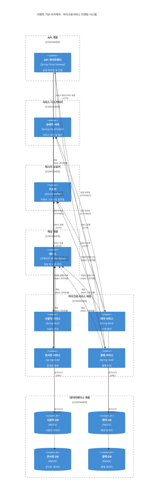
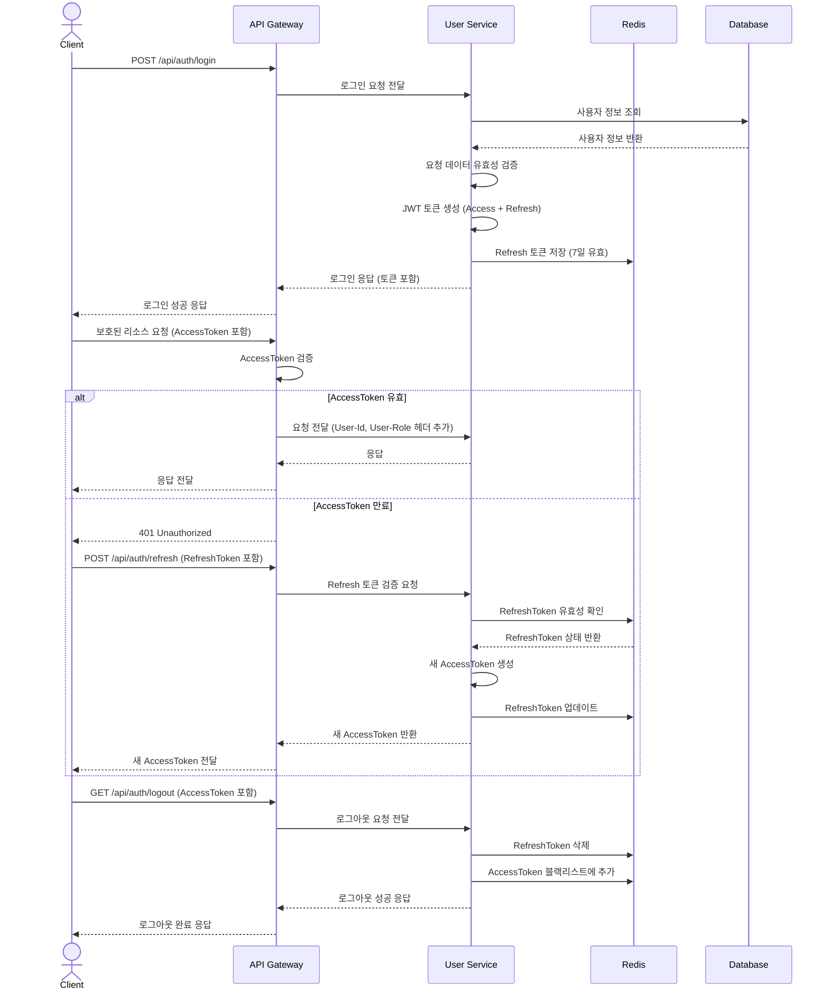
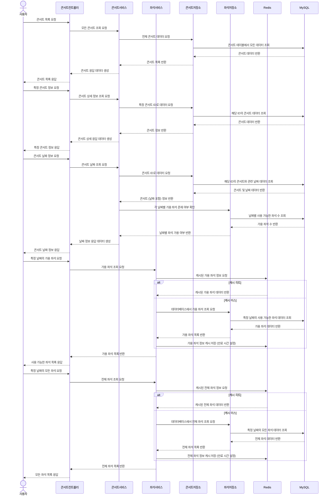
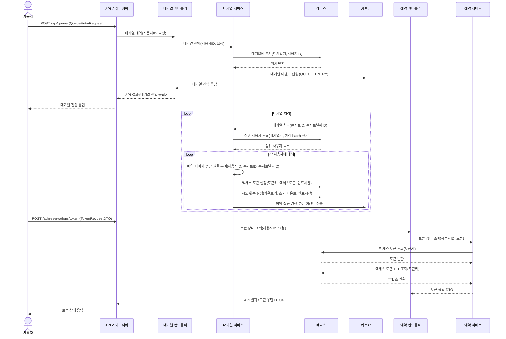
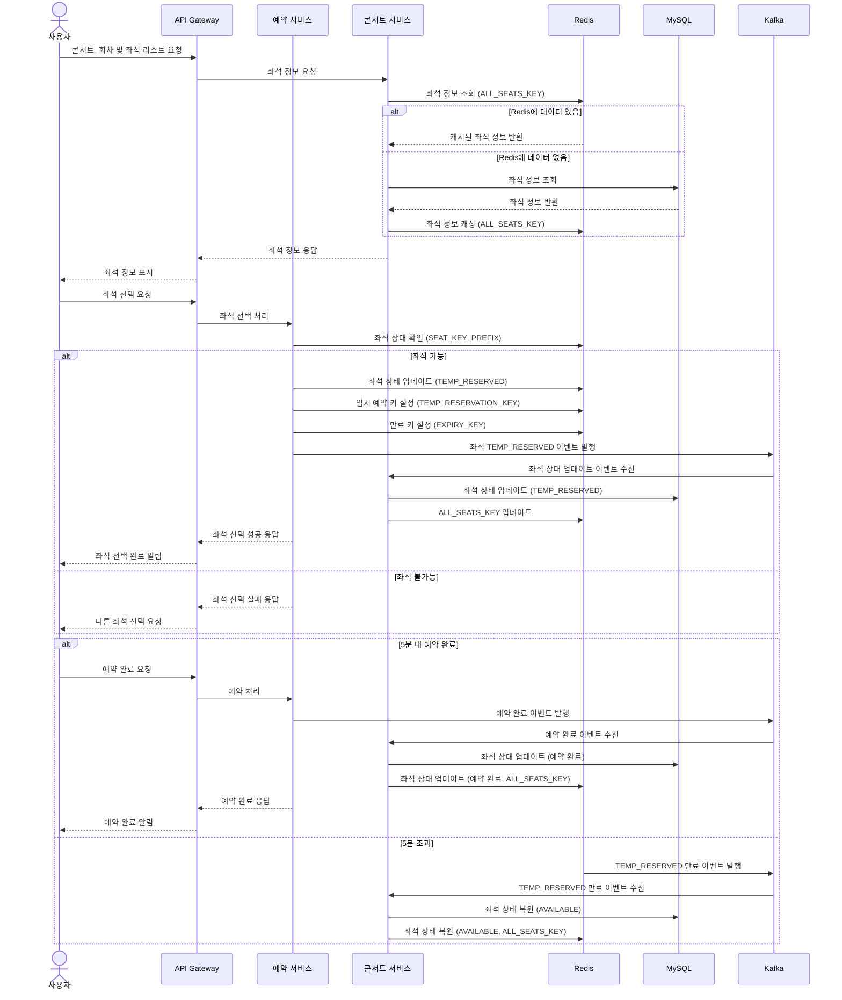
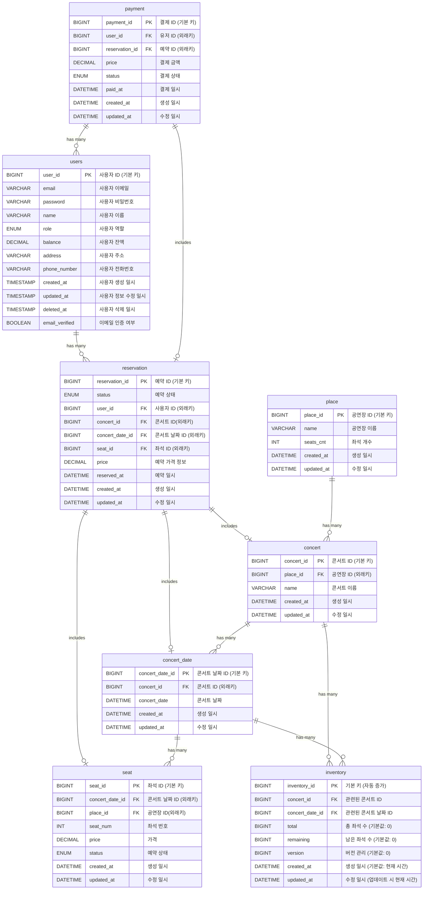

# 콘서트 티켓 좌석 예매

### *시나리오 - 콘서트 좌석 예매 서비스*

### 목차

- [1. 요구사항 분석](##one)
- [2. 동시성 제어 처리 로직 비교 구현](https://iwannabarmus.tistory.com/30)
- [3. DB Index 사용과 비교](https://iwannabarmus.tistory.com/36)
- [4. 대기열 설계 및 구현]()
- [5. Transaction 범위와 책임 분리 방안 설계](https://iwannabarmus.tistory.com/38)
- [6. 부하테스트 & 장애 대응](https://iwannabarmus.tistory.com/41)
- [Trouble Shooting](##4.-Trouble-Shooting)
- [주차별 인사이트](##5.-개발하면서-끄적)
- [기술 스택](##6.-기술-스택)

---
<h2 id="one">1. 요구사항 분석</h2>

### 프로젝트 Milestone & 요구사항 명세서 & API 명세서

[구글닥스 문서 바로가기](https://docs.google.com/spreadsheets/d/17yUn-cEa9uq2jE7_bTpjfXoeaXIAGt_91FmHhMm2BJo/edit?gid=0#gid=0)

### POSTMAN UI

[POSTMAN UI](https://documenter.getpostman.com/view/14042841/2sA3kSoPGR)

### 시스템 아키텍처

### UML 다이어그램

인증&인가 프로세스

콘서트 서비스 프로세스

대기열 프로세스

예매 프로세스

### ERD 명세

데이터베이스 객체 관계 다이어그램

---

## 2. 동시성 제어 처리 로직 비교 구현

[콘서트 예약 서비스에서 발생할 수 있는 동시성 이슈와 처리 방안](https://iwannabarmus.tistory.com/30)

---

## 3. DB Index 사용과 비교

[성능 향상을 위한 DB Index 사용과 비교](https://iwannabarmus.tistory.com/36)

---

## 4. 대기열 설계 및 구현

1. 유즈 케이스 설정

* 콘서트 목록 조회, 콘서트 상세 정보 조회, 콘서트 날짜 조회 API는 대기열 적용 제외
* 특정 콘서트 날짜의 좌석 조회 API에 대기열 적용
* 사용자가 콘서트 날짜를 선택하고 '좌석 선택' 버튼을 클릭할 때 대기열 진입

2. API 목록

* 대기열 진입 및 상태 조회
    * POST /api/queue
        * request: QueueEntryRequest (concertId, concertDateId)
        * response: QueueEntryResponse (userId, position, concertId, concertDateId)
        * 새로운 대기열 진입 요청 시 Redis에 사용자 추가 및 대기 순서 반환
* 대기열 상태 조회
    * GET /api/queue/status
        * request: QueueEntryRequest (concertId, concertDateId)
        * response: QueueStatusResponse (userId, concertId, concertDateId, status, position, token)
        * 현재 대기 상태, 순서, 접근 토큰(발급된 경우) 반환
* 토큰 상태 조회
    * POST /api/reservations/token
        * request: TokenRequestDTO (concertId, concertDateId)
        * response: TokenResponseDTO (userId, concertId, concertDateId, status, position, token, expiryTime)
        * 토큰의 유효성, 만료 시간, 대기 상태 정보 반환
* 클라이언트는 QueueStatusResponse의 status가 READY가 될 때까지 주기적으로 상태 조회 API를 호출
* READY 상태가 되면 좌석 조회 페이지로 이동, 이후 요청 시 헤더에 토큰 포함

3. 대기열 및 토큰 구현

* Redis를 사용하여 대기열과 토큰 관리
* 대기열: Sorted Set 사용 (key: queue:{concertId}:{concertDateId}, score: 진입 시간, member: userId)
* 토큰: String 사용 (key: token:{userId}:{concertId}:{concertDateId}, value: 생성된 토큰)
* 토큰 상태:
    * WAITING: 대기열에 있는 상태
    * READY: 접근 권한이 부여된 상태
    * NOT_IN_QUEUE: 대기열에 없는 상태
* 토큰 만료: 발급 후 일정 시간(예: 10분) 경과 시 자동 삭제

4. 대기열 처리 및 토큰 활성화 방식

* 주기적으로(예: 10초마다) 일정 수(예: 100명)의 사용자를 대기열에서 제거하고 접근 토큰 발급
* Kafka를 사용하여 대기열 처리 이벤트 발행 및 소비
* 처리 과정:
    1. Redis에서 상위 N명의 사용자 조회
    2. 각 사용자에 대해 접근 토큰 생성 및 저장
    3. 대기열에서 해당 사용자 제거
    4. Kafka를 통해 접근 권한 부여 이벤트 발송

5. 동시 접속자 및 대기 시간 계산

* 예상 좌석 선택 및 예약 완료 시간: 3분
* 시스템 처리 용량: 분당 2,000명 (약 33 TPS)
* 좌석 조회 및 예약 API 호출 횟수: 3회 (좌석 조회, 좌석 선택, 결제)
* 분당 처리 가능한 실제 사용자 수: 약 660명
* 대기열 처리: 10초마다 110명씩 접근 토큰 발급
* 대기 순서 및 예상 대기 시간 계산:
    - 대기 순서 = 현재 사용자의 대기열 위치
    - 예상 대기 시간(분) = (대기 순서 / 110) * (10 / 60)

6. 구현 상세

* QueueService:
    - enterQueue(): 사용자를 대기열에 추가
    - getQueueStatus(): 현재 대기 상태 조회
    - processQueue(): 대기열에서 사용자를 제거하고 접근 토큰 발급
* ReservationService:
    - getTokenStatus(): 토큰 상태 및 유효성 확인
* Redis 작업:
    - 대기열 추가/제거: ZADD, ZREM 명령어 사용
    - 대기 순서 조회: ZRANK 명령어 사용
    - 토큰 저장 및 조회: SET, GET 명령어 사용 (만료 시간 설정)
* 동시성 처리:
    - Redis의 원자적 작업을 활용하여 동시성 이슈 최소화
    - 낙관적 락을 사용하여 동시 수정 충돌 방지

---

## 5. Transaction 범위와 책임 분리 방안 설계

[Transaction 범위와 책임 분리 방안 설계](https://iwannabarmus.tistory.com/38)

---

## 6. 부하테스트 & 장애 대응

[k6로 부하테스트 해보기](https://iwannabarmus.tistory.com/41)

---

## Trouble Shooting

*모든 과정을 기록할 수는 없었지만, 5주차 진행 과정에서의 나의 트러블 슈팅 과정을 기록하였다.*

[Trouble Shooting 기록 바로가기](https://iwannabarmus.tistory.com/27)

---

## 주차별 인사이트

1주차 인사이트

#### 1. **모놀리식 프로젝트의 개발 환경 구성**

- **구성 요소**: Docker, Gradle, Spring Boot, MySQL을 사용하여 개발 환경을 구성.
- **프로젝트 구조**:
    - Dockerfile과 Gradle 설정 파일
    - MySQL 데이터베이스 초기화 스크립트
    - Spring Boot 애플리케이션 소스 코드
- **설정 파일**:
    - `docker-compose.yml`을 통해 데이터베이스와 애플리케이션 서비스 정의
    - `build.gradle`에서 의존성 관리 및 빌드 설정

#### 2. **도메인 주도 설계(DDD)로 전환**

- **문제점**: 모놀리식 아키텍처의 확장성 한계, 유지보수 어려움, 협업 비효율성
- **해결책**:
    - DDD 패턴 도입으로 도메인 지식 반영, 책임 분리, 유연한 확장성 확보
    - 효율적인 협업, 유지보수성 향상, 비즈니스 로직 반영

#### 3. **환경 변수 설정 및 트러블슈팅**

- **추가된 설정**:
    - MySQL의 `hikari` 설정 (풀 사이즈, 타임아웃 등)
    - 에러 페이지, 서블릿 파라미터 등 서버 설정
- **트러블슈팅 사례**:
    - Docker Compose 파일 위치 문제: `application.yml`에서 Docker Compose 자동 실행 비활성화

#### 4. **레포지토리 추상화**

- **장점**:
    - 구현체 교체의 용이성 (JPA, NoSQL 등)
    - 비즈니스 로직과 데이터 접근 로직의 분리
    - 테스트 용이성 (Mock 객체 활용)
    - 유연성과 확장성
    - 디자인 패턴의 장점 (Repository Pattern)

#### 5. **로그인/로그아웃 구현**

- **로그인**:
    - `AuthenticationManager`를 통한 인증 후 `SecurityContextHolder`에 사용자 정보 저장
    - JWT 토큰 생성 및 반환
- **로그아웃**:
    - `accessToken` 유효성 검증 후 사용자 정보 삭제
    - `refresh_tokens` 테이블에서 리프레시 토큰 삭제

#### 6. **데이터베이스 선택 및 관리**

- **요구사항**:
    - 데이터 무결성, 복잡한 데이터 관계 관리, 강력한 쿼리 기능, 확장성과 고가용성, 보안 및 접근 제어
- **MySQL 선택 이유**:
    - 사용의 용이성, 광범위한 호환성, 강력한 성능과 안정성, 비용 효율성

#### 7. **ERD 설계 중요 요소**

- **중요한 점**:
    - 데이터 간의 관계와 무결성 유지
    - 정규화를 통한 중복 최소화
    - 각 엔티티의 속성과 제약 조건 정의

### 결론

1주차 데이터에서는 프로젝트의 기본적인 개발 환경 설정, 아키텍처 전환, 환경 변수 설정, 데이터 접근의 추상화, 로그인/로그아웃 구현, 데이터베이스 선택 및 관리, 그리고 ERD 설계의 중요한 요소들을
다루었습니다. 이를 통해 데이터 무결성, 확장성, 유지보수성, 보안 등의 중요한 요구사항을 충족할 수 있는 방법들을 적용하였습니다.

2주차 인사이트

#### 1. **동시성 관리**

- **고민 사항**: 여러 사용자가 동시에 대기열에 진입하거나 대기 상태를 확인할 때 발생하는 데이터 꼬임과 시스템 성능 저하.
- **해결 방안**: 데이터베이스의 동시성 제어 기능을 활용. 락(lock) 메커니즘이나 트랜잭션을 통해 데이터를 안전하게 관리.

#### 2. **성능 최적화**

- **고민 사항**: 대기열에 많은 사용자가 진입할 때 발생하는 성능 저하.
- **해결 방안**: 효율적인 쿼리 작성과 인덱싱을 통해 데이터베이스 접근을 최적화. 캐싱 도입으로 빈번한 데이터베이스 조회를 줄임.

#### 3. **자동 만료 처리**

- **고민 사항**: 일정 시간 동안 대기 상태가 유지될 때 이를 자동으로 만료시키는 문제.
- **해결 방안**: 스케줄러를 도입하여 주기적으로 대기열 상태를 확인하고, 만료된 항목을 처리. 데이터베이스에서 제거하거나 상태를 변경.

#### 4. **순번 관리**

- **고민 사항**: 대기 상태인 사용자 중에서 누가 먼저 활성 상태로 전환될지 관리하는 문제.
- **해결 방안**: FIFO 방식이나 우선순위 큐를 사용해 순번을 정확히 관리. 순번 관리 로직을 잘 설계.

#### 5. **토큰 발급 및 검증**

- **고민 사항**: 사용자가 대기열에 진입할 때 유일한 토큰을 발급하고 이를 통해 사용자 식별.
- **해결 방안**: JWT를 사용해 토큰을 발급하고 검증. 보안성을 높이고 변조를 방지.

#### 6. **사용자 경험**

- **고민 사항**: 대기열에 있는 사용자가 자신의 상태를 쉽게 확인하고 예상 대기 시간을 알 수 있도록 하는 문제.
- **해결 방안**: 사용자에게 대기 상태와 예상 대기 시간을 명확히 전달하는 API와 UI 제공. WebSocket이나 SSE를 사용해 실시간으로 상태를 업데이트.

#### 7. **데이터 일관성 및 복구**

- **고민 사항**: 시스템 오류나 예기치 않은 상황에서 데이터 일관성을 유지하고 복구하는 문제.
- **해결 방안**: 데이터베이스의 트랜잭션 관리와 롤백 메커니즘 활용. 로그와 백업을 통해 복구 가능한 시스템 설계.

#### 8. **확장성**

- **고민 사항**: 시스템이 확장 가능하도록 설계.
- **해결 방안**: 마이크로서비스 아키텍처 도입. 클라우드 인프라 활용해 자원을 동적으로 할당.

### 리팩토링 및 MSA 전환

1. **엔티티 분리**

- 기존 모놀리식 구조에서 각 서비스(User, Reservation, Concert)의 엔티티를 분리. 각 서비스는 자체 엔티티를 관리하고, 다른 서비스의 엔티티와의 직접 참조를 제거.

2. **서비스 간 통신**

- Kafka를 사용해 서비스 간 통신. 각 서비스가 필요한 이벤트를 발행하고, 다른 서비스에서 이를 구독하여 처리.

3. **API 게이트웨이**

- Spring Cloud Gateway를 사용해 API 게이트웨이를 구현. JWT 토큰을 파싱하여 사용자 정보를 각 서비스에 전달.

4. **데이터 일관성 유지**

- 초기에는 결과적 일관성(Eventual Consistency)을 목표로 하고, 필요에 따라 점진적으로 개선. Kafka를 통한 이벤트 기반 아키텍처 활용.

5. **점진적 리팩토링**

- 서비스 분리: 각 도메인별로 서비스를 분리.
- 데이터베이스 분리: 각 서비스의 데이터베이스를 분리.
- 서비스 간 통신 구현: Kafka를 통한 통신 구현.
- API 게이트웨이 구현: 인증/인가 및 라우팅 담당.
- 점진적 개선: 성능, 확장성 모니터링 및 개선.

### 결론

이번 2주차 인사이트에서는 대기열 기능 구현 시의 고민 사항과 해결 방안을 중심으로, 서비스 리팩토링 및 MSA 전환에 필요한 개념과 전략을 학습하고 일부 시행했습니다.
이를 통해 시스템의 안정성과 확장성을 높이는 데 기여했습니다.

3주차 인사이트

### 1. 프로젝트 구조 및 변경 사항

#### 마이크로서비스 아키텍처 전환

- **모놀리식에서 MSA로 전환**: 프로젝트가 단일 모놀리식 데이터베이스에서 서비스별 데이터베이스를 가지는 마이크로서비스 아키텍처로 전환되었습니다.
- **서비스별 데이터베이스**: User Service, Reservation Service, Concert Service 각각 독립적인 MySQL 컨테이너로 구성되었습니다.
- **Docker Compose**: 모든 데이터베이스 서비스를 하나의 `compose.yml` 파일로 관리하여 일괄적인 실행과 관리가 가능하게 되었습니다.

#### Core 모듈의 리팩토링

- **공통 기능 유지**: 공통으로 사용되는 클래스는 core 모듈에 유지되었습니다.
- **서비스 특화 기능 이동**: 특정 서비스에 종속적인 클래스는 해당 서비스 모듈로 이동되었습니다.
- **인터페이스 추상화**: 공통적으로 사용되는 서비스는 인터페이스만 core 모듈에 두고 구현은 각 서비스에서 하도록 변경되었습니다.
- **공통 유틸리티 집중**: 공통적으로 사용되는 유틸리티 클래스는 core 모듈에 집중시켜 중복을 방지했습니다.

### 2. 주요 구현 사항

#### API Gateway 서비스 구현

- **Spring Cloud Gateway** 기반의 API Gateway 서비스 구현.
- **주요 기능**: 요청 라우팅, JWT 인증 및 인가, 요청/응답 필터링, 로드 밸런싱, 서비스 디스커버리 통합.
- **JWT 인증**: AuthorizationHeaderFilter를 통해 JWT 토큰 검증을 수행하고 유효한 토큰에서 사용자 정보를 추출하여 헤더에 추가.

#### build.gradle 설정 개선

- **플러그인 적용**: 필요한 플러그인은 서브프로젝트에서만 적용하도록 설정.
- **공통 설정**: 모든 프로젝트와 서브프로젝트에 적용될 설정을 `allprojects`와 `subprojects` 블록에서 정의.
- **의존성 관리**: 공통 의존성은 루트 `build.gradle` 파일에서 관리하고, 각 모듈에서는 필요한 추가 의존성을 정의.
- **QueryDSL 설정**: 필요한 서브프로젝트에 QueryDSL 설정을 적용하도록 클로저를 정의.

### 3. 문제 해결

#### Core 모듈 의존성 문제 해결

- **불필요한 클래스 제거**: 특정 서비스에 종속적인 클래스는 core 모듈에서 제거하고 해당 서비스로 이동.
- **공통 유틸리티 유지**: 여러 서비스에서 공통으로 사용하는 유틸리티 클래스는 core 모듈에 남김.
- **인터페이스 분리**: 공통 인터페이스는 core에 유지하고, 구현은 각 서비스 모듈에서 하도록 변경.

#### 빌드 오류 해결

- **Gradle 설정 파일 수정**: `settings.gradle`과 `build.gradle` 파일을 수정하여 모든 모듈이 올바르게 인식되도록 함.
- **의존성 명확화**: 각 모듈의 `build.gradle` 파일에서 필요한 의존성을 명확하게 선언.
- **플러그인 적용 문제 해결**: 루트 `build.gradle` 파일에서 플러그인을 올바르게 적용하고, 각 서브프로젝트에서 필요한 플러그인을 적용하도록 수정.

4주차 인사이트

### 1. 트랜잭션과 락 메커니즘

#### **주요 내용:**

- 트랜잭션의 ACID 속성과 데이터 일관성을 보장하기 위한 비관적 락과 낙관적 락의 사용.
- 트랜잭션 격리 수준 설정과 락 메커니즘을 통해 동시성 문제를 해결.

#### **인사이트:**

- 비관적 락과 낙관적 락은 각각의 특성과 장단점이 있으므로, 시스템의 동시성 요구사항에 따라 적절히 선택하여 사용해야 합니다.
- 트랜잭션 격리 수준을 적절히 설정하여 데이터 일관성과 성능을 최적화할 수 있습니다.
- 락 메커니즘을 효율적으로 사용하여 동시성 문제를 해결하고, 데이터베이스 성능을 향상시킬 수 있습니다.

### 2. 필터 및 예외 처리

#### **주요 내용:**

- Spring Cloud Gateway를 사용한 요청 본문 처리 및 필터 설정.
- AuthorizationHeaderFilter와 RequestBodyFilter의 설정 및 문제 해결.
- 예외 발생 시 로깅 및 재처리를 통한 시스템 안정성 확보.

#### **인사이트:**

- 필터 체인을 통해 요청 본문과 헤더를 적절히 처리하는 것이 중요합니다. 이를 통해 시스템의 일관성을 유지할 수 있습니다.
- 예외 처리 로직을 강화하여 시스템의 신뢰성을 높이고, 문제 발생 시 원인을 쉽게 추적할 수 있도록 합니다.

### 3. 성능 테스트 및 최적화

#### **주요 내용:**

- 다양한 부하 테스트 도구(JMeter, Locust, K6, Python's requests)를 사용하여 성능 테스트를 실시.
- 테스트 결과를 바탕으로 성능 병목 지점을 식별하고 최적화 방안을 모색.

#### **인사이트:**

- 성능 테스트 도구의 선택은 시스템의 특성과 요구사항에 따라 달라져야 합니다. 예를 들어, JMeter는 GUI를 통한 사용이 쉬운 반면, Locust와 K6는 코드 기반 설정으로 유연성이 높습니다.
- 성능 테스트 결과를 분석하여 병목 지점을 식별하고, 이를 개선하기 위한 구체적인 방안을 마련하는 것이 중요합니다.
- 응답 시간, 처리량, 오류율 등을 종합적으로 분석하여 시스템의 성능을 최적화할 수 있습니다.

### 4. 이벤트 기반 아키텍처

#### **주요 내용:**

- 서비스 간의 독립성을 유지하고, 확장성과 유연성을 높이기 위한 이벤트 기반 아키텍처 설계.
- Kafka를 사용한 서비스 간 메시지 브로커 역할과 이벤트 드리븐 아키텍처 구현.

#### **인사이트:**

- 이벤트 기반 아키텍처를 통해 서비스 간의 느슨한 결합을 유지하고, 확장성과 유연성을 높일 수 있습니다.
- Kafka를 사용하여 서비스 간의 비동기 통신을 구현함으로써 시스템의 성능을 향상시키고, 처리량을 증가시킬 수 있습니다.
- 이벤트 드리븐 아키텍처는 시스템의 확장성과 유연성을 높이기 위한 중요한 요소입니다.

### 5. 데이터베이스 설계 및 인덱스 최적화

#### **주요 내용:**

- 각 서비스에 독립적인 데이터베이스를 사용하여 데이터 일관성 확보.
- 인덱스 설정을 통한 데이터베이스 성능 최적화.
- 효율적인 쿼리 작성과 데이터베이스 락 메커니즘 적용.

#### **인사이트:**

- 데이터베이스 설계 시 각 서비스의 요구사항을 반영하여 테이블 구조를 최적화하는 것이 중요합니다.
- 인덱스를 적절히 설정함으로써 검색 속도를 향상시키고, 쿼리 성능을 최적화할 수 있습니다.
- 트랜잭션과 락 메커니즘을 효과적으로 사용하여 데이터 일관성과 무결성을 유지할 수 있습니다.

### 6. 인프라 구성 및 최적화

#### **주요 내용:**

- Spring Cloud API Gateway와 Eureka Discovery Server를 사용한 마이크로서비스 인프라 구성.
- Redis를 이용한 캐싱과 데이터 저장.
- 인프라 모니터링 및 성능 최적화 방안.

#### **인사이트:**

- Spring Cloud API Gateway와 Eureka를 사용하여 마이크로서비스 간의 서비스 디스커버리와 라우팅을 효율적으로 관리할 수 있습니다.
- Redis를 활용한 캐싱은 데이터 접근 속도를 향상시키고, 데이터베이스의 부하를 줄일 수 있습니다.
- 인프라 모니터링 도구를 사용하여 시스템의 성능을 지속적으로 모니터링하고, 병목 지점을 식별하여 최적화하는 것이 중요합니다.

### 7. API 설계 및 문서화

#### **주요 내용:**

- RESTful API 설계 및 명세서 작성.
- 엔드포인트 정의와 요청/응답 데이터 구조 설계.
- API 문서화를 통해 개발자 간의 의사소통 원활화.

#### **인사이트:**

- 명확하고 일관된 API 설계를 통해 시스템의 유지보수성을 높일 수 있습니다.
- API 문서화를 통해 개발자 간의 의사소통을 원활하게 하고, 개발 속도를 향상시킬 수 있습니다.
- RESTful API 설계 원칙을 준수하여, 확장성과 유연성을 갖춘 API를 제공할 수 있습니다.

### 종합 결론

4주차 동안의 데이터는 MSA 구조에서의 예약 시스템 구현 및 최적화에 중점을 두고 있습니다. 이를 통해 다음과 같은 주요 인사이트를 도출할 수 있습니다:

- 트랜잭션과 락 메커니즘을 효율적으로 사용하여 동시성 문제를 해결하고, 데이터 일관성과 성능을 향상시킬 수 있습니다.
- 필터 체인을 통해 요청 본문과 헤더를 적절히 처리하고, 예외 처리 로직을 강화하여 시스템의 안정성과 신뢰성을 높이는 것이 필요합니다.
- 성능 테스트 도구의 선택은 시스템의 특성과 요구사항에 따라 달라져야 하며, 성능 테스트 결과를 분석하여 병목 지점을 식별하고 최적화하는 것이 중요합니다.
- 이벤트 기반 아키텍처를 통해 서비스 간의 독립성을 유지하고, 시스템의 확장성과 유연성을 높일 수 있습니다.
- 데이터베이스 성능 최적화를 위해 인덱싱과 단일 `UPDATE` 쿼리를 사용하는 것이 효과적입니다.
- Spring Cloud API Gateway와 Eureka를 사용하여 마이크로서비스 간의 서비스 디스커버리와 라우팅을 효율적으로 관리할 수 있습니다.
- 명확하고 일관된 API 설계를 통해 시스템의 유지보수성을 높일 수 있습니다.

---

## 기술 스택

1. 주요 프레임워크 및 라이브러리:
    - Spring Boot 3.3.0
    - Spring Data JPA 3.3.0
    - Spring Web 3.3.0
    - Spring Security 3.3.0
    - Spring Validation 3.3.0
    - Spring Cloud Netflix Eureka Client 4.1.2
    - Spring Cloud OpenFeign 4.1.2
    - Spring Data Redis 3.3.0
    - Spring Kafka 3.2.0
    - Spring Boot Actuator 3.3.0
    - Spring Boot Mail 3.3.0
    - Spring Cloud Gateway 4.1.4

2. 데이터베이스:
    - MySQL Connector/J 8.3.0
    - Redisson 3.24.3

3. 쿼리 및 ORM:
    - Querydsl JPA 5.0.0

4. 메시징:
    - Apache Kafka (Spring Kafka 3.2.0에 의해 관리)

5. 인증 및 보안:
    - JSON Web Token (JWT) 0.12.5 (jwt-api, jwt-impl, jwt-jackson)

6. 로깅:
    - Log4j2 2.23.1 (log4j-api, log4j-core, log4j-slf4j2-impl)

7. 개발 도구:
    - Lombok 1.18.32
    - Netty Resolver DNS Native MacOS 4.1.68.Final

8. 빌드 및 의존성 관리:
    - Gradle 8.8
    - Spring Dependency Management Plugin 1.1.5

9. Java 버전:
    - Java 17

## 테스트

- 테스트 코드 주석 참고

